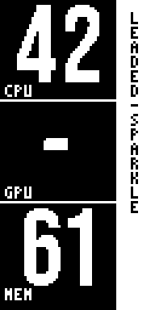

# portrait-numerals — the OLED v2's suzu face

A 128×64 OLED composed in portrait (the unit stands on its long
edge): three stacked readouts — CPU / GPU / MEM — in big condensed
numerals from a real display font, a yellow name band down the right
edge, and 1-px pulse dividers between areas, lit by the audio.level
fast lane. Striking, legible from across the room, honest about what
it doesn't know (an unmeasured slot is a dash, never a zero).



## Package contract

A faceplate is a **package of resources + placements + art**. The
installing tool pushes what `faceplate.yaml` declares, verbatim; it
never interprets art. The face itself speaks suzu/1 on the serial
line — that handshake is the only contract between the Resident and
the art.

| File | Role |
|---|---|
| `faceplate.yaml` | the declaration: slots, extras, frames, resources |
| `main.py` | the face: frame parser + composition (pushed as `main.py`) |
| `digits_bebas.py` | digit sprites generated from Bebas Neue (data only) |
| `BebasNeue-OFL.txt` | the font's license, shipped with its art |
| `preview.png` | host-rendered proof of the composition (not installed) |

Fallback: if `digits_bebas.py` is missing, the face renders a built-in
4×7 numeral table scaled 4× — the same face, honest cloth.

## Frames (suzu/1, `suzu-t`, newline-terminated)

| Frame | Meaning |
|---|---|
| `I` | identity → `OK,{descriptor}*hh` (proto, version, faceplate, coverage, hardware_id) |
| `K` | keepalive → `OK`; also wakes the face from rest |
| `G,report,<cpu>,<mem>,<gpu>` | ground.set in declared slot order; 255 = not measured → dash |
| `A,audio.level,<0..100>` | fast atom → the pulse dividers (attack instant, decay exponential) |
| `J,{json}` | context escape; `"name"` sets the band |
| `S,<name>` | compat alias for the band (dev convenience) |
| `X` | overlay restore → `OK` (nothing overlaid yet) |
| `R,<signal>,<urgency>,<hue>,<arc>,<seq>[,<label>]` | a ring → the dividers blink once; ack echoes `seq` with checksum |

Checksums (`*hh`, xor of the preceding bytes) are verified on receipt —
a bad checksum is dropped, and state self-heals on the next frame.
After 10 s without frames the face rests (contrast dims); any frame
wakes it.

## Regenerating the digits

The sprites are generated, not hand-drawn:

```
python tools/font2sprites.py \
    --font tools/fonts/BebasNeue-Regular.ttf \
    --out faceplates/esp8266-oled-v2/portrait-numerals/digits_bebas.py
```

Swap the font for any condensed display face (Big Shoulders class is
the standing alternative — the Keeper's call) with the same command.

## Previewing without hardware

```
python tools/preview_faceplate.py faceplates/esp8266-oled-v2/portrait-numerals
```

Executes the face's own `main.py` against a fake framebuffer and a
scripted frame feed, then renders the portrait view. `--fallback`
hides the font module to prove the fallback path.
